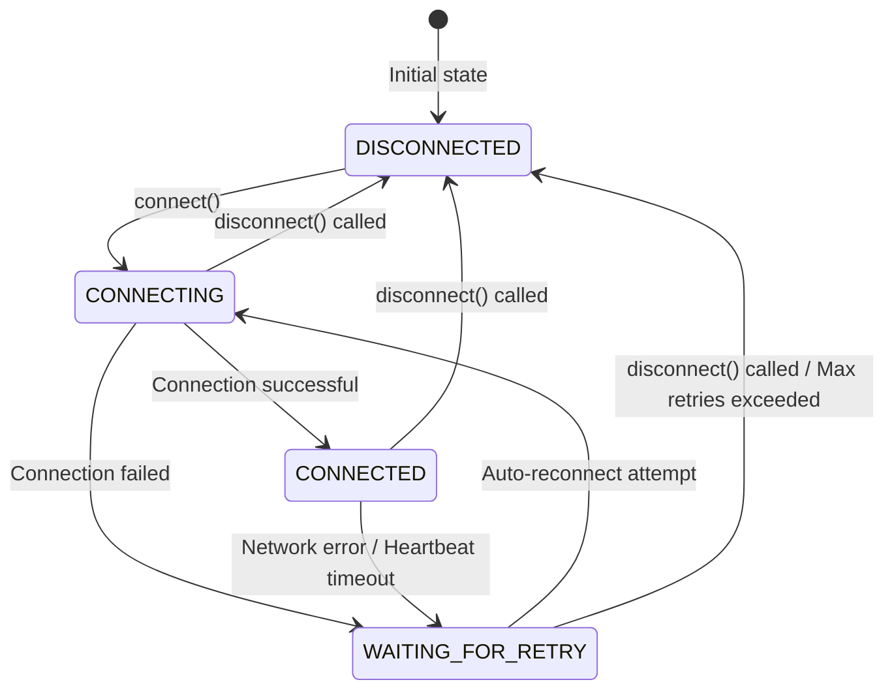

# S7ClientSession API Documentation | S7ClientSession 接口文档

> Production-ready S7 PLC session client with auto-reconnection and heartbeat | 支持自动重连和心跳的生产级 S7 PLC 会话客户端

---

## Table of Contents | 目录

1. [Overview | 概述](#overview--概述)
2. [Installation | 安装](#installation--安装)
3. [Quick Start | 快速开始](#quick-start--快速开始)
4. [API Reference | API 参考](#api-reference--api-参考)
5. [Configuration Options | 配置选项](#configuration-options--配置选项)
6. [Events | 事件](#events--事件)
7. [Connection States | 连接状态](#connection-states--连接状态)
8. [Error Handling | 错误处理](#error-handling--错误处理)
9. [Best Practices | 最佳实践](#best-practices--最佳实践)

---

## Overview | 概述

[S7ClientSession](../src/runtime/session/S7ClientSession.ts#L33-L334) is a high-level session management client built on top of [S7ScheduleClient](../src/runtime/client/S7ScheduleClient.ts#L78-L733). It provides:

- **Auto-Reconnection**: Exponential backoff retry policy for connection failures
- **Heartbeat Mechanism**: Session health monitoring with configurable ping modes
- **State Machine**: Connection state management with event emissions
- **IO Method Delegation**: All [S7ScheduleClient](.../src/runtime/client/S7ScheduleClient.ts#L78-L733) IO methods are available
- **Session Lifecycle**: Proper start/end lifecycle management

[S7ClientSession](../src/runtime/session/S7ClientSession.ts#L33-L334) is a high-level session management client built on top of [S7ScheduleClient](..src/runtime/client/S7ScheduleClient.ts#L78-L733) 构建的高层会话管理客户端，提供以下功能：

- **自动重连**：连接失败时采用指数退避重试策略
- **心跳机制**：可配置 ping 模式的会话健康监控
- **状态机**：带事件发射的连接状态管理
- **IO 方法委托**：所有 [S7ScheduleClient](.../src/runtime/client/S7ScheduleClient.ts#L78-L733) 的 IO 方法均可用
- **会话生命周期**：正确的 start/end 生命周期管理

---

## Installation | 安装

```bash
npm install @teamwang-design/s7-runtime
```

---

## Quick Start | 快速开始

```typescript
import {
	S7ClientSession,
	AddressType,
	IOLevel,
	HeartbeatPingMode,
} from '@teamwang-design/s7-runtime';

// Create session with options
const session = new S7ClientSession({
	connect: {
		ip: '127.0.0.1',
		port: 102,
		addressType: AddressType.RACK_SLOT,
		rack: 0,
		slot: 1,
		timeout: 10000,
	},
	heartbeat: {
		interval: 1500,
		maxFailures: 5,
		mode: HeartbeatPingMode.TOGGLE_BIT,
		dbNumber: 2026,
		start: 0,
	},
	reconnect: {
		disable: false,
	},
});

// Start session
session.start();

// Listen to events
session.on('connect', async () => {
	const buf = Buffer.alloc(4);
	buf.write('aric', 'utf-8');

	// Use IO methods
	await session.dbWrite(2026, 10, 4, buf, 2000, IOLevel.NORMAL);
});
```

---

## API Reference | API 参考

### Constructor | 构造函数

#### `new S7ClientSession(options: S7ClientSessionOptions, logger?: Logger)`

| Parameter | Type                                                                              | Required | Description                                     |
| --------- | --------------------------------------------------------------------------------- | -------- | ----------------------------------------------- |
| `options` | [S7ClientSessionOptions](..src/runtime/session/S7ClientSession.types.ts#L38-L122) | Yes      | Session configuration options                   |
| `logger`  | [Logger](../src/logger/Logger.types.ts#L0-L6)                                     | No       | Custom logger instance (default: consoleLogger) |

---

### Lifecycle Methods | 生命周期方法

#### `start(): void`

Start the session connection.

启动会话连接。

**Note**: Does nothing if session state is not `DISCONNECTED` (e.g., already CONNECTED/CONNECTING/WAITING_FOR_RETRY)

---

#### `end(): void`

End the session and cleanup resources.

结束会话并清理资源。

**Actions**:

- Clears retry timer
- Dispatches disconnect action
- Removes heartbeat listeners

---

#### `getSessionId(): string`

Get unique session identifier.

获取唯一会话标识符。

**Returns**:

- TSAP mode: `${ip}:${localTSAP}:${remoteTSAP}`
- Address mode: `${ip}:${rack}:${slot}`

---

#### `isAlive(): boolean`

Check if session is currently connected.

检查会话当前是否已连接。

**Returns**: `true` if state is [CONNECTED](../src/state/connect/ConnectState.types.ts#L4-L4), `false` otherwise

---

### IO Methods | IO 方法

All IO methods from [S7ScheduleClient](../src/runtime/client/S7ScheduleClient.ts#L78-L733) are delegated. See [S7ScheduleClient API](client.md) for detailed documentation.

| Method                       | Description                |
| ---------------------------- | -------------------------- |
| `readArea()`                 | Read from specified area   |
| `writeArea()`                | Write to specified area    |
| `dbRead()`                   | Read from Data Block       |
| `dbWrite()`                  | Write to Data Block        |
| `dbWriteHeartbeatBit()`      | Write heartbeat bit        |
| `dbWriteHeartbeatSequence()` | Write heartbeat sequence   |
| `abRead()`                   | Read from Output Area      |
| `abWrite()`                  | Write to Output Area       |
| `ebRead()`                   | Read from Input Area       |
| `ebWrite()`                  | Write to Input Area        |
| `mbRead()`                   | Read from Memory Area      |
| `mbWrite()`                  | Write to Memory Area       |
| `tmRead()`                   | Read Timer values          |
| `tmWrite()`                  | Write Timer values         |
| `ctRead()`                   | Read Counter values        |
| `ctWrite()`                  | Write Counter values       |
| `readMultiVars()`            | Read multiple variables    |
| `writeMultiVars()`           | Write multiple variables   |
| `getPlcDateTime()`           | Get PLC datetime           |
| `setPlcDateTime()`           | Set PLC datetime           |
| `setPlcSystemDateTime()`     | Set PLC to system datetime |
| `getCpuInfo()`               | Get CPU info               |
| `getCpInfo()`                | Get CP info                |
| `plcStatus()`                | Get PLC status             |

---

## Configuration Options | 配置选项

### S7ClientSessionOptions

```typescript
interface S7ClientSessionOptions {
	connect: ConnectOptions;
	reconnect: ReconnectOptions;
	heartbeat: HeartbeatOptions;
}
```

---

### ConnectOptions | 连接选项

| Property                                                      | Type                                                                                                                                       | Default   | Description                    |
| ------------------------------------------------------------- | ------------------------------------------------------------------------------------------------------------------------------------------ | --------- | ------------------------------ |
| [ip](../src\runtime\session\S7ClientSession.types.ts#L27-L27) | `string`                                                                                                                                   | -         | PLC IP address                 |
| rack                                                          | `number`                                                                                                                                   | `0`       | PLC rack number                |
| slot                                                          | `number`                                                                                                                                   | `1`       | PLC slot number                |
| timeout                                                       | `number`                                                                                                                                   | `2000`    | Connection timeout (ms)        |
| addressType                                                   | [AddressType](../src/runtime/session/S7ClientSession.types.ts#L21-L24)                                                                     | `ADDRESS` | Connection type (ADDRESS/TSAP) |
| localTSAP                                                     | `number` / `string`                                                                                                                        | -         | Local TSAP (for TSAP mode)     |
| remoteTSAP                                                    | `number` / `string`                                                                                                                        | -         | Remote TSAP (for TSAP mode)    |
| port                                                          | `number`                                                                                                                                   | `102`     | S7 protocol port               |
| connectionType                                                | [ConnectionType](https://github.com/mathiask88/node-snap7/blob/1b15218c7a2b7d6b6455454e43fdf4c4797285d3/doc/client.md#set-connection-type) | `0x03`    | Connection type                |

---

### ReconnectOptions | 重连选项

| Property   | Type      | Default | Description              |
| ---------- | --------- | ------- | ------------------------ |
| disable    | `boolean` | `false` | Disable auto-reconnect   |
| initDelay  | `number`  | `1000`  | Initial retry delay (ms) |
| maxDelay   | `number`  | `30000` | Maximum retry delay (ms) |
| maxRetries | `number`  | `10`    | Maximum retry attempts   |

**Retryable Errors | 可重试错误**:

- [ECONNREFUSED](../src/errors/S7Error.ts#L2-L2)
- [ECONNRESET](../src/errors/S7Error.ts#L3-L3)
- [ETIMEDOUT](../src/errors/S7Error.ts#L4-L4)

---

### HeartbeatOptions | 心跳选项

| Property | Type                                                                    | Default      | Description                     |
| -------- | ----------------------------------------------------------------------- | ------------ | ------------------------------- |
| interval | `number`                                                                | `5000`       | Heartbeat interval (ms)         |
| timeout  | `number`                                                                | `2000`       | Heartbeat timeout (ms)          |
| dbNumber | `number`                                                                | -            | Target DB number                |
| start    | `number`                                                                | -            | Start offset in DB              |
| mode     | [HeartbeatPingMode](../src/features/keepalive/Heartbeat.types.ts#L2-L5) | `TOGGLE_BIT` | Ping mode (TOGGLE_BIT/SEQUENCE) |

**Note**:

- `dbNumber` and `start` are required when heartbeat is enabled (default: enabled)
- Missing `dbNumber/start` will cause heartbeat initialization failure

---

## Events | 事件

`S7ClientSession` extends `EventEmitter` and emits the following events:

| Event        | Parameters                             | Description                              |
| ------------ | -------------------------------------- | ---------------------------------------- |
| connect      | `(sessionId: string)`                  | Emitted when connection established      |
| disconnect   | `(sessionId: string)`                  | Emitted when connection closed           |
| connecting   | `(sessionId: string)`                  | Emitted when connection attempt starts   |
| reconnecting | `(sessionId: string, attempt: number)` | Emitted when reconnection attempt starts |
| connState    | `(prev: State, next: State)`           | Emitted when connection state changes    |
| error        | `(sessionId: string, error: Error)`    | Emitted when error occurs                |

### Example | 示例

```typescript
session.on('connect', (sessionId) => {
	console.log(`Connected: ${sessionId}`);
});

session.on('disconnect', (sessionId) => {
	console.log(`Disconnected: ${sessionId}`);
});

session.on('reconnecting', (sessionId, attempt) => {
	console.log(`Reconnecting: ${sessionId}, attempt: ${attempt}`);
});

session.on('error', (sessionId, error) => {
	console.error(`Error: ${sessionId}, ${error.message}`);
});
```

---

## Connection States | 连接状态

### State Enum | 状态枚举

| State        | Description                                              |
| ------------ | -------------------------------------------------------- |
| DISCONNECTED | Session is disconnected (initial state)                  |
| CONNECTING   | Connection attempt in progress                           |
| CONNECTED    | Session is connected and active                          |
| RECONNECTING | Reconnection attempt in progress (after connection loss) |

### State Transition Diagram | 状态转换图



---

## Error Handling | 错误处理

### Error Types | 错误类型

| Error Class                                        | Code                                           | Description        |
| -------------------------------------------------- | ---------------------------------------------- | ------------------ |
| [S7Error](../src/errors/S7Error.ts#L13-L34)        | -                                              | Base S7 error      |
| [S7ErrorCode](../src/errors/S7ErrorCode.ts#L0-L18) | [ESHUTDOWN](../src/errors/S7Error.ts#L7-L7)    | Session destroyed  |
| [S7ErrorCode](../src/errors/S7ErrorCode.ts#L0-L18) | [ECONNREFUSED](../src/errors/S7Error.ts#L1-L1) | Connection refused |
| [S7ErrorCode](../src/errors/S7ErrorCode.ts#L0-L18) | [ECONNRESET](../src/errors/S7Error.ts#L2-L2)   | Connection reset   |
| [S7ErrorCode](../src/errors/S7ErrorCode.ts#L0-L18) | [ETIMEDOUT](../src/errors/S7Error.ts#L3-L3)    | Connection timeout |

### Example | 示例

```typescript
import { S7Error, S7ErrorCode } from '@teamwang-design/s7-runtime';

try {
	await session.dbRead(1, 0, 100);
} catch (error) {
	if (error instanceof S7Error) {
		if (error.code === S7ErrorCode.ESHUTDOWN) {
			console.error('Session has been destroyed');
		} else if (error.code === S7ErrorCode.ETIMEDOUT) {
			console.error('Operation timed out');
		}
	}
}
```

---

## Best Practices | 最佳实践

### English

1. **Call start() at Appropriate Timing**:
    - The session will only attempt to connect when `start()` is explicitly called (no automatic connection after construction).
    - `start()` does **nothing** if the session state is not `DISCONNECTED` (e.g., already connected/reconnecting), so it’s safe to call multiple times but unnecessary.
2. **Call end() on Shutdown**: Properly cleanup resources (retry timer, heartbeat, state machine) when application exits
3. **Listen to Events**: Monitor connection state (connect/disconnect/reconnecting/error) for debugging and monitoring
4. **Configure Reconnect**: Enable auto-reconnect for production environments (tune `initDelay`/`maxDelay`/`maxRetries` based on business needs)
5. **Enable Heartbeat**: Detect dead connections early with heartbeat (configure `interval`/`maxFailures` to balance performance and reliability)
6. **Handle Errors**: Wrap IO calls in try-catch blocks (distinguish retryable errors like `ETIMEDOUT` from fatal errors like `ESHUTDOWN`)
7. **Check isAlive()**: Verify connection state (via `isAlive()`) before critical operations to avoid failed IO requests

### 中文

1. **在合适时机调用 start()**：
    - 会话仅在显式调用 `start()` 时才会尝试连接（构造后不会自动连接）；
    - 若会话状态非 `DISCONNECTED`（如已连接/正在重连），调用 `start()` **无任何效果**，因此多次调用是安全的，但无必要。
2. **退出时调用 end()**：应用退出时调用 `end()` 清理资源（重试定时器、心跳监听、状态机）
3. **监听事件**：监控连接状态事件（connect/disconnect/reconnecting/error），用于调试和业务监控
4. **配置重连**：生产环境启用自动重连，并根据业务需求调整 `initDelay`/`maxDelay`/`maxRetries` 参数
5. **启用心跳**：通过心跳机制提前检测死连接，合理配置 `interval`/`maxFailures` 平衡性能与可靠性
6. **处理错误**：用 try-catch 包裹 IO 调用，区分可重试错误（如 `ETIMEDOUT`）和致命错误（如 `ESHUTDOWN`）
7. **检查 isAlive()**：关键操作前通过 `isAlive()` 验证连接状态，避免 IO 请求失败

---

## Complete Example | 完整示例

### English

```typescript
import {
	S7ClientSession,
	AddressType,
	IOLevel,
	HeartbeatPingMode,
} from '@teamwang-design/s7-runtime';

async function main() {
	const session = new S7ClientSession({
		connect: {
			ip: '127.0.0.1',
			port: 102,
			addressType: AddressType.RACK_SLOT,
			rack: 0,
			slot: 1,
			timeout: 10000,
		},
		reconnect: {
			disable: false,
			initDelay: 1000,
			maxDelay: 30000,
			maxRetries: 10,
		},
		heartbeat: {
			interval: 1500,
			maxFailures: 5,
			mode: HeartbeatPingMode.TOGGLE_BIT,
			dbNumber: 2026,
			start: 0,
		},
	});

	// Event listeners
	session.on('connect', (id) => console.log('Connected:', id));
	session.on('disconnect', (id) => console.log('Disconnected:', id));
	session.on('error', (id, err) => console.error('Error:', id, err));

	// Start session
	session.start();

	// Wait for connection
	await new Promise((resolve) => session.once('connect', resolve));

	// Perform IO operations
	const data = await session.dbRead(1, 0, 100);
	console.log('Data:', data);

	// Graceful shutdown
	process.on('SIGINT', () => {
		session.end();
		process.exit(0);
	});
}

main().catch(console.error);
```

---

## License | 许可证

MIT License | MIT 许可证
